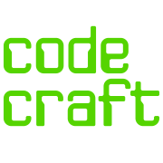
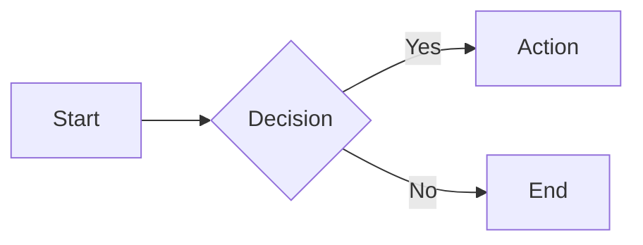

<div align="center">
  
</div>

> A modern, lightweight static site generator built with Python and Jinja2 — no Jekyll, no Ruby, just Python simplicity.

[](https://github.com/lucianofedericopereira/codecraft/actions)
[](https://www.python.org/downloads/)
[](https://www.gnu.org/licenses/old-licenses/gpl-2.0.en.html)

**CodeCraft** is a Python-powered static site generator designed for developers who want full control over their blog without the complexity of Ruby-based tools. Built with modern Python practices, type hints, and a clean CLI interface.

---

## ✨ Features

### 🚀 **Core Features**

- **Pure Python** — No Ruby, no Jekyll, no complex dependencies
- **Modern CLI** — Unified `codecraft.py` command for all operations
- **Fast Builds** — Efficient markdown processing with Pygments syntax highlighting
- **Live Preview** — Built-in development server with auto-reload
- **GitHub Actions** — Automatic deployment to GitHub Pages
- **RSS Feed** — Auto-generated feed for subscribers
- **Client-side Search** — Powered by Lunr.js with pre-built index
- **Multi-language Support** — Date formatting for English, Spanish, and Italian

### 🎨 **Content Features**

- **Markdown + Frontmatter** — Write in clean markdown with YAML metadata
- **Syntax Highlighting** — Beautiful code blocks via Pygments
- **Table of Contents** — Auto-generated TOC for long posts
- **Mermaid Diagrams** — Embed flowcharts, sequence diagrams, and more
- **CodePen Embeds** — Integrate live CodePen examples
- **Interactive Examples** — Inline code viewer with tabs (HTML/CSS/JS) and live preview
- **Custom Fonts** — Configure multiple fonts via YAML
- **Comments** — Integrated Utterances (GitHub-based comments)

### 🛠️ **Developer Experience**

- **Type Hints** — Full type annotations throughout codebase
- **Comprehensive Docs** — Docstrings on every function and class
- **Clean Architecture** — Organized constants, utilities, and processing functions
- **Extensible** — Easy to add custom filters, templates, and processors
- **Automated Testing** — Optional linting with Ruff in CI/CD
- **Dependabot** — Automatic dependency updates with PR grouping

---

## 📁 Project Structure

```
codecraft/
├── codecraft.py                    # Unified CLI tool (build, serve, watch, new)
├── publish.py                 # Core site builder class
├── requirements.txt           # Python dependencies
│
├── content/                   # Markdown blog posts
│   ├── code/                  # Programming & tech posts
│   ├── design/                # Design & UX posts
│   └── projects/              # Project showcases
│
├── themes/                    # Theme configuration
│   ├── config.yaml            # Site configuration
│   ├── templates/             # Jinja2 templates
│   │   ├── codeCraft.html     # Main layout
│   │   ├── posts.html         # Post listing
│   │   ├── category.html      # Category pages
│   │   ├── archive.html       # Archive page
│   │   ├── feed.xml           # RSS template
│   │   └── search.json        # Search index template
│   ├── sections/              # Special pages (home, archive, etc.)
│   └── assets/                # Static files (CSS, JS, fonts, images)
│
├── examples/                  # Interactive code examples
│   ├── 1.html                 # Example files
│   └── README.md              # Examples documentation
│
├── build/                     # Generated static site (gitignored)
│
└── .github/
    ├── workflows/
    │   └── publish.yml        # CI/CD workflow
    └── dependabot.yml         # Dependency management
```

---

## 🚀 Quick Start

### Prerequisites

- **Python 3.12+** (3.11+ also supported)
- **pip** package manager
- **Git** (for deployment)

### Installation

```bash
# Clone the repository
git clone https://github.com/yourusername/codecraft.git
cd codecraft

# Install dependencies
pip install -r requirements.txt
```

### Create Your First Post

```bash
# Using the CLI (recommended)
python codecraft.py new -c code -t "My First Post"

# Or create manually
cat > content/code/hello-world.md << 'EOF'
---
title: "Hello World"
date: 2025-12-24
comments: true
toc: true
---

## Welcome to CodeCraft!

This is my first post using CodeCraft.
EOF
```

### Build and Preview

```bash
# Build the site
python codecraft.py build

# Start local server
python codecraft.py serve

# Visit http://localhost:8000
```

### Deploy to GitHub Pages

```bash
git add .
git commit -m "Add new post"
git push origin main

# GitHub Actions automatically builds and deploys! ✨
```

---

## 📝 Writing Posts

### Frontmatter Options

```yaml
---
title: "Your Post Title"           # Required
date: 2025-12-24                   # Required (YYYY-MM-DD)
comments: true                     # Enable GitHub-based comments
toc: true                          # Auto-generate table of contents
mermaid: false                     # Enable Mermaid diagram support
codepen: false                     # Enable CodePen embeds
banner: false                      # Show banner on category pages
sidebar: true                      # Show sidebar (default: true)
---
```

### Markdown Features

#### Code Blocks with Syntax Highlighting

```markdown
```python
def hello_world():
    print("Hello, CodeCraft!")
```
```

#### Mermaid Diagrams

```markdown

```

#### Interactive Examples

```markdown
Create an HTML file in `examples/1.html`:

```html
<!DOCTYPE html>
<html>
<head>
  <style id="example-css">
    button { background: linear-gradient(45deg, #667eea, #764ba2); }
  </style>
</head>
<body>
  <button>Click Me!</button>
  <script id="example-js">
    console.log('Interactive example!');
  </script>
</body>
</html>
```

Then embed it in your post:

```markdown
[example:1]
```

This creates a split-pane viewer with tabs (HTML/CSS/JS) and live preview!

---

## ⚙️ Configuration

Edit `themes/config.yaml` to customize your site:

```yaml
# Site metadata
meta:
  title: design﹢code
  tagline: CodeCraft Chronicles
  author: Your Name
  repository: https://github.com/yourusername
  license: GPLv2
  locale: en

# Deployment settings
base:
  url: yourusername.github.io
  folder: repository-name  # Leave empty for user/org pages

# Social links
links:
  LinkedIn: https://linkedin.com/in/yourprofile
  GitHub: https://github.com/yourusername

# Post categories
sections:
  - design
  - code
  - projects

# Custom fonts
assets:
  fonts:
    - type: title
      name: Mediaan
      weight: Regular
      extension: woff2
    - type: body
      name: VisueltPro
      weight: Regular
      extension: woff2

# Feature defaults by path
rules:
  - scope:
      path: content/code
    features:
      toc: true
      comments: false

# External scripts
scripts:
  mermaid: 11.4.1
  lunr: 2.3.9

# Comments (Utterances)
comments:
  theme: github-light
  repo: yourusername/comments
  issue: title
```

---

## 🔧 CLI Reference

The unified `codecraft.py` CLI provides all tools you need:

### Build Commands

```bash
# Build the entire site
python codecraft.py build

# Clean build artifacts
python codecraft.py clean
```

### Development Server

```bash
# Start server on default port (8000)
python codecraft.py serve

# Use custom port
python codecraft.py serve -p 3000

# The server automatically:
# - Removes <base> tags for local development
# - Fixes asset paths (./assets/ → /assets/)
# - Disables console suppression scripts
```

### Auto-Rebuild

```bash
# Watch for changes and rebuild (requires pyinotify)
python codecraft.py watch

# Install pyinotify:
pip install pyinotify

# Or use inotify-tools (Linux):
# Ubuntu/Debian: sudo apt install inotify-tools
# Fedora: sudo dnf install inotify-tools
```

### Create Posts

```bash
# Basic post creation
python codecraft.py new -c code -t "My Article Title"

# With custom slug
python codecraft.py new -c design -t "UI Tips" -s ui-design-tips

# With features enabled
python codecraft.py new -c code -t "Python Tutorial" --mermaid --codepen

# Open in editor after creation
python codecraft.py new -c code -t "My Post" --edit

# Specify custom date
python codecraft.py new -c code -t "Post" -d 2025-12-25

# Force overwrite existing file
python codecraft.py new -c code -t "Post" -f
```

### Help

```bash
# General help
python codecraft.py --help

# Command-specific help
python codecraft.py new --help
python codecraft.py serve --help
```

---

## 🚢 Deployment

### GitHub Pages (Automatic)

1. **Enable GitHub Pages**
   - Go to **Settings** → **Pages**
   - Under **Source**, select **GitHub Actions**

2. **Push to Main**
   ```bash
   git add .
   git commit -m "Update content"
   git push origin main
   ```

3. **Automatic Build**
   - GitHub Actions triggers on push
   - Builds site with Python 3.12
   - Runs optional linting with Ruff
   - Deploys to GitHub Pages
   - Live in ~2 minutes

### Manual Deployment

```bash
# Build locally
python codecraft.py build

# The build/ directory contains the complete static site
# Deploy to any static host (Netlify, Vercel, etc.)
```

### Manual GitHub Actions Trigger

1. Go to **Actions** tab
2. Select "Build and Deploy"
3. Click **Run workflow**

---

## 🏗️ Architecture

### Core Components

```python
# publish.py — SiteBuilder class
class SiteBuilder:
    """Main site builder with methods for:
    - Loading configuration
    - Parsing markdown with frontmatter
    - Processing Jinja2 templates
    - Generating RSS feed and search index
    - Copying static assets
    """

    def build(self) -> None:
        """Complete build pipeline:
        1. Clean output directory
        2. Collect posts from content/
        3. Collect pages from themes/sections/
        4. Render all pages with templates
        5. Generate feed.xml and search.json
        6. Copy static assets
        7. Generate CSS from template
        """
```

### Markdown Processing Pipeline

1. **Extract Include Directives** — `` → placeholders
2. **Extract Example Shortcodes** — `[example:1]` → placeholders
3. **Extract Mermaid Blocks** — Save for later restoration
4. **Highlight Code Blocks** — Pygments syntax highlighting
5. **Convert to HTML** — Python-Markdown with extensions
6. **Add CSS Classes** — Inline code classes
7. **Restore Mermaid** — Insert with proper classes
8. **Process Includes** — Render sub-templates
9. **Render Final Page** — Complete HTML output

### Template Hierarchy

```
codeCraft.html (main layout)
├── posts.html (recent posts listing)
├── category.html (category-specific posts)
└── archive.html (all posts by year)
```

---

## 🎨 Customization

### Custom Templates

Edit `themes/templates/codeCraft.html`:

```jinja2
<!DOCTYPE html>
<html lang="{{ site.meta.locale }}">
<head>
  <title>{{ page.title }} - {{ site.meta.title }}</title>
  <!-- Custom filters available -->
  <meta name="date" content="{{ page.date | date_format('%Y-%m-%d') }}">
</head>
<body>
  {{ page.content | safe }}
</body>
</html>
```

### Available Jinja2 Filters

- `date_format(format)` — Format dates with strftime
- `month_year(lang)` — "Jan 2024" format
- `date_archive(lang)` — "Nov 17" format
- `date_full(lang)` — "Nov 17, 2024" format
- `year` — Extract year from date
- `strip_whitespace` — Remove all whitespace
- `split(separator)` — Split string into list

### Custom CSS

Edit `themes/assets/codeCraft.css` (Jinja2 template):

```css
/* Custom fonts are injected from config.yaml */

@font-face {
  font-family: '{{ font.name }}';
  src: url('{{ font.name }}.{{ font.extension }}');
  font-weight: {{ font.weight_num }};
}


/* Your custom styles */
body {
  font-family: 'VisueltPro', sans-serif;
}
```

### Adding New Sections

1. Edit `themes/config.yaml`:
   ```yaml
   sections:
     - design
     - code
     - projects
     - tutorials  # New section
   ```

2. Create directory:
   ```bash
   mkdir content/tutorials
   ```

3. Create category page:
   ```bash
   cat > themes/sections/tutorials.md << 'EOF'
   ---
   title: Tutorials
   ---
   
   EOF
   ```

4. Add posts:
   ```bash
   python codecraft.py new -c tutorials -t "My First Tutorial"
   ```

---

## 🧪 Testing

### Local Testing

```bash
# Full build test
python codecraft.py clean
python codecraft.py build
ls -la build/

# Test specific outputs
cat build/index.html
cat build/feed.xml
cat build/search.json

# Preview in browser
python codecraft.py serve
open http://localhost:8000
```

### Validate Generated HTML

```bash
# Install validator
npm install -g html-validator-cli

# Validate output
html-validator build/index.html
```

### Check RSS Feed

```bash
# View feed
cat build/feed.xml

# Validate feed (online)
# https://validator.w3.org/feed/
```

---

## 🐛 Troubleshooting

### Build Issues

**Problem:** Build fails with `ModuleNotFoundError`
```bash
# Solution: Reinstall dependencies
pip install --upgrade -r requirements.txt
```

**Problem:** Python version error
```bash
# Check version
python --version  # Should be 3.12+

# Use specific version
python3.12 codecraft.py build
```

**Problem:** Template not found
```bash
# Ensure templates directory exists
ls themes/templates/

# Verify template names in publish.py match files
```

### Deployment Issues

**Problem:** GitHub Actions fails
```bash
# Check Python version in .github/workflows/publish.yml
# Should be 3.12

# Verify requirements.txt is committed
git ls-files requirements.txt

# Check Actions logs on GitHub
```

**Problem:** Site not updating after push
```bash
# Check Actions status
# GitHub → Actions tab → View workflow run

# Clear browser cache
# Wait 2-3 minutes for GitHub Pages CDN

# Verify GitHub Pages settings
# Settings → Pages → Source: GitHub Actions
```

### Development Server Issues

**Problem:** Port already in use
```bash
# Use different port
python codecraft.py serve -p 3001

# Kill process using port 8000 (Linux/Mac)
lsof -ti:8000 | xargs kill -9
```

**Problem:** Assets not loading locally
```bash
# The dev server rewrites paths automatically
# If issues persist, check browser console

# Verify asset paths in build/
ls -R build/assets/
```

---

## 📊 Performance

### Build Times

- **Small site** (10 posts): ~0.5s
- **Medium site** (50 posts): ~2s
- **Large site** (200 posts): ~8s

### Optimizations

- Pip caching in GitHub Actions
- Incremental builds not needed (fast enough)
- Static file copying uses `shutil.copy2` (preserves metadata)
- Pygments caching via Python imports

---

## 🔒 Security

### Best Practices

- ✅ Minimal permissions in GitHub Actions
- ✅ No secret tokens in repository
- ✅ Dependabot for automated updates
- ✅ YAML safe loading (no arbitrary code execution)
- ✅ Jinja2 autoescape enabled
- ✅ No user input in templates

### Content Security

- Use `| safe` filter sparingly
- Validate URLs in config
- Review Dependabot PRs before merging
- Monitor GitHub Actions logs

---

## 🤝 Contributing

Contributions welcome! This is a personal project, but feel free to:

1. Fork the repository
2. Create a feature branch
3. Make your changes
4. Test thoroughly
5. Submit a pull request

### Development Setup

```bash
# Clone your fork
git clone https://github.com/yourusername/codecraft.git

# Create virtual environment
python -m venv venv
source venv/bin/activate  # Windows: venv\Scripts\activate

# Install dependencies
pip install -r requirements.txt

# Install dev dependencies
pip install ruff pyinotify

# Run linter
ruff check .

# Test build
python codecraft.py build
python codecraft.py serve
```

---

## 📄 License

This project is licensed under the **GNU General Public License v2.0** (GPLv2).

See [LICENSE](LICENSE) file for details.

---

## 🙏 Acknowledgments

Built with these excellent tools:

- **[Python](https://python.org)** — Programming language
- **[Jinja2](https://jinja.palletsprojects.com/)** — Template engine
- **[Python-Markdown](https://python-markdown.github.io/)** — Markdown processor
- **[Pygments](https://pygments.org/)** — Syntax highlighting
- **[PyYAML](https://pyyaml.org/)** — YAML parser
- **[python-frontmatter](https://github.com/eyeseast/python-frontmatter)** — Frontmatter parser
- **[Lunr.js](https://lunrjs.com/)** — Client-side search
- **[Mermaid](https://mermaid.js.org/)** — Diagram rendering
- **[Utterances](https://utteranc.es/)** — GitHub-based comments
- **[GitHub Actions](https://github.com/features/actions)** — CI/CD
- **[GitHub Pages](https://pages.github.com/)** — Hosting

Inspired by the simplicity of static site generators, but built with Python's elegance.

---

## 📞 Support

- **Issues:** [GitHub Issues](https://github.com/lucianofedericopereira/codecraft/issues)
- **Discussions:** [GitHub Discussions](https://github.com/lucianofedericopereira/codecraft/discussions)
- **Author:** [Luciano Pereira](https://github.com/lucianofedericopereira)

---

**Made with ❤️ using Python + Jinja2**

*No Jekyll, no Ruby, just Python simplicity.*
