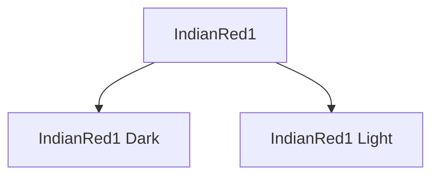
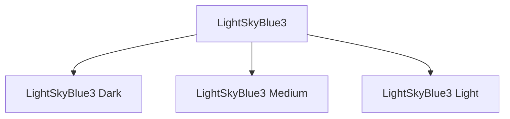

A Proposal for a Clearer Naming Convention

## Overview

The Xterm 256-color palette contains several entries that map to the same X11 color name. These repetitions occur because multiple palette slots are mathematically close to the same X11 color value. To improve clarity and reduce ambiguity, this document proposes a simple, deterministic naming convention for repeated names.

## Goals

- Provide unique, human-readable names for all palette entries.
- Preserve the original X11-derived base names when possible.
- Avoid introducing arbitrary numbering or opaque suffixes.
- Maintain backward clarity without requiring full renaming of the palette.

## History

In the early days of computing, terminals offered no color at all. Monochrome screens — green or amber phosphor glowing against a dark backdrop — were built for efficiency, not aesthetics. Their purpose was straightforward: provide a fast, reliable interface to powerful mainframes and minicomputers.

As UNIX spread through universities and research labs in the 1970s and ’80s, the terminal became a symbol of elegant minimalism: a keyboard, a screen, and a steady stream of text. Functional, durable, and visually austere.

### The Shift Toward Color

By the late 1980s and early 1990s, ANSI escape codes introduced basic color output, giving software the ability to highlight warnings, errors, and important messages. But the palette was tiny — just 16 system colors. Useful, yes, but far from expressive.

A major shift arrived in 1999, when Xterm — one of the most influential terminal emulators on UNIX and Linux — adopted a patch by Todd Larason, integrated by maintainer Thomas Dickey, adding support for 256 colors. Overnight, terminals gained an expanded range of hues: subtle grays, richer tones, and a far broader RGB spectrum.

The Palette’s Structure — and Its Legacy Baggage

The 256-color expansion wasn’t a redesign; it was an extension layered onto the decades-old ANSI model. That legacy still shapes how we describe and use terminal colors today.

- **0–15**: ANSI system colors: The familiar original 16 — black, red, green, yellow, blue, magenta, cyan, white, plus their bright variants.
- **16–231**: The RGB cube: A mathematically defined 6×6×6 cube. Each channel (red, green, blue) uses six intensity levels: 0, 95, 135, 175, 215, and 255, generating 216 distinct colors.
- **232–255**: Grayscale ramp: Twenty-four evenly spaced steps from near-black to near-white.

This structure reflects a time when terminals relied entirely on numeric color slots, while the web was only beginning to standardize how colors were named:

- CSS Level 1 (1996) introduced just a handful of named colors.
- CSS Level 2 (1998–1999) added more keywords like navy and lightgreen, but hex notation remained the norm.

By contrast, Xterm’s palette stayed purely numerical. The names we commonly associate with it today came later — retrofits meant to make the palette more approachable.

### X11: Where the Color Names Actually Came From

Xterm itself did not define names such as IndianRed1, LightSkyBlue3, or DarkOliveGreen2. These labels were borrowed from the X11 color database, a long-standing collection of descriptive color names used in the X Window System.

As libraries and tools sought more readable identifiers, they mapped Xterm’s numeric entries to the closest X11 equivalents. This provided familiar labels, but introduced inconsistencies.

### Why So Many Names Repeat

Because the Xterm palette is smaller and more coarse-grained than X11’s, the mapping from numbers to names was never one-to-one. This created several quirks:

### ANSI legacy overlap

- The first 16 slots already had classic names like red and bright red.
- RGB cube collisions: Many cube colors are close matches to multiple X11 colors, so different slots inherited the same name. Example: IndianRed1 appears twice; both entries sit near the same X11 hue.
- Grayscale ambiguity; The 24 grayscale values are all mapped to generic names such as Gray or White, even though each slot is distinct.

These repetitions aren’t errors in Xterm’s design — they’re side effects of grafting the X11 naming ecosystem onto a palette originally intended to be numeric only.

## Proposal

- If a color name occurs multiple times in the Xterm 256-color palette, suffixes are added based on the number of occurrences and their relative brightness.

### Two occurrences of the same base name

If a name appears exactly twice, append:

- Dark — for the entry with lower brightness
- Light — for the entry with higher brightness

Example:




### Three occurrences of the same base name

If a name appears three times, append:

- Dark — lowest brightness
- Medium — middle brightness
- Light — highest brightness

Example:



### More than three occurrences

(Not currently observed in the Xterm palette, but included for completeness.)

If the same base name appears four or more times, sort entries by brightness and suffix them as:

Darkest, Darker, Dark, Light, Lighter, Lightest

This keeps the system extensible without losing clarity.

### Brightness Metric

Brightness sorting uses a standard perceived-luminance formula:

```brightness=0.2126R+0.7152G+0.0722B```

Where R, G, and B are the palette’s 8-bit RGB values.
Lower numeric brightness = “darker,” higher = “lighter.”

### Backward Compatibility

This proposal does not remove or overwrite any existing names.
It only adds distinguishing suffixes where duplicates occur, preserving the original base name for searchability and documentation compatibility.


